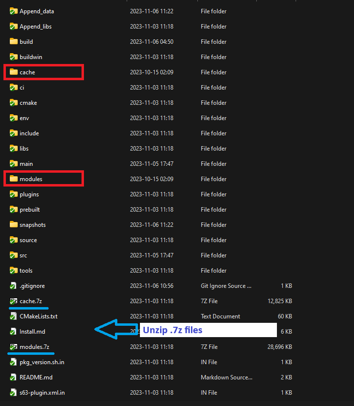
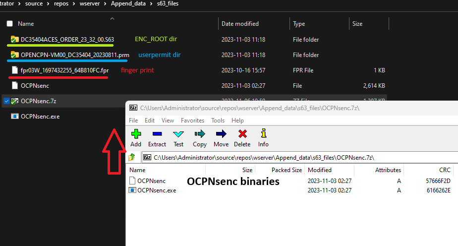
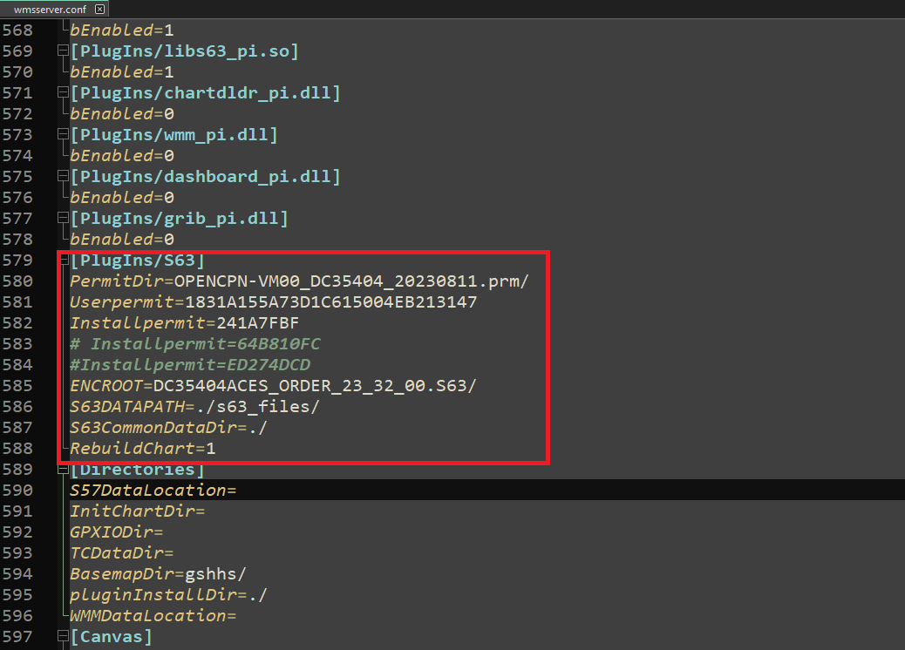

# WMS 1.3 server install and test guide

## Supported OS
  Ubuntu 22.04.2 LTS and Windows 7+

## Steps - Windows
### Steps - Obtain a executable file by compile source codes.
* At first, unzip the "modules.7z" and "cache.7z" files.
* Install Visual Studio 2019 and cmake version 3.26.4.
* After installed cmake, append the following path into system environment's path.
   cmake_path/bin/cmake.exe(cmake_path is path of cmake installed in your system)
* Run "x86 Native Tools Command Prompt" of Visual Studio 2019.
* Go to the project path.
* Run the following commands.
  - mkdir build
  - cd build
  - cmake ..
* Close the Command Prompt and check the "build" directory that contains the WMSServer.sln file.
* Open the solution with Visual Studio 2019.
* Go to "Build" menu - "Configuration Manager".
* set "Active solution configuration" to "Release" and build the "WMSServer" project.
* Run the "command prompt" and go to the "Release" path and execute the "WMSServer.exe".
  Wait until the message "Press Enter to stop the server or '!' to restart the server..." is displayed.

## Steps - Ubuntu server 22.04.3 LTS
* Run the following commands.
  - sudo apt install ubuntu-gnome-desktop 
  - reboot
* Go to the project path
* Unzip the "cache.7z" and "modules.7z" file. then 2 folders (cache and modules) will be generated.
* Go to the project path and run the following commands.
  - sudo apt install devscripts equivs
  - sudo mk-build-deps -i -r ci/control
  - sudo apt-get --allow-unauthenticated install -f
  - sudo apt-get install -y binutils-dev uuid-dev libssl-dev  
  - sudo apt-get install libgtk-3-dev
  - mkdir build
  - cd build
  - cmake ..
  - make -j4
* Execute the "build/WMSServer".
  Wait until the message "Press Enter to stop the server or '!' to restart the server..." is displayed.

### NOTE:
	Opencpn uses a lot of packages(GUI components too) and those packages were integrated complicatedly into source.

## Pre-Build Steps
* The `${ProjectHome}` is the path that `CMakeLists.txt` file is located.
* The directory that contains ENC files must be typed at `ENCDirPath` in `${ProjectHome}/env/config.json` file.  
* The rendered image file prefix must be typed at "IMGFilePath" in `${ProjectHome}/env/config.json` file.
* The ssl certificate files should be located in `${ProjectHome}/Append_data/tools/certificates/` directory.
* Please unzip `7z x OCPNsenc.7z` on `${ProjectHome}/Append_data/s63_files/` directory. (OCPNsenc.exe for windows, OCPNsenc for Ubuntu 64)
* In Ubuntu, it needs to run `chmod +x OCPNsenc`.
* Please copy `s63 ENC_ROOT`, `s63 UserPermit` directories to the `Appended_data/s63_files` directory..
* Please rename `${ProjectHome}/Append_data/wmsserver.conf.example` as `${ProjectHome}/Append_data/wmsserver.conf`.
* Please check `${ProjectHome}/Appended_data/wmsserver.conf` for `Userpermit`, `Installpermit`, `PermitDir` and `ENCROOT` parameters.

## Pre-Run Steps
* Copy all ENC files into the directory indicated in "config.json" file.
* Should modify the port number for HTTP and HTTPS in "config.json" file.
* The default result image directory is specified at "IMGDirPath" in "config.json" file.
  If you want to change it, remove the directory and make a new directory. Specify the new directory path into "config.json" file.

## Close Step
* To close the server, should enter "exit" and press `Enter`.

## Configuration
*Please check the server configuration on "wmsserver.conf" file.*

  **[Settings/GlobalState]**
  
    bShowS57ImportantTextOnly=0 	
    // Important Text Only 0: disable, 1: enable
    bShowMeta=0 					        
    // Chart Information Objects
    bShowNationalText=0 			    
    // National text on chart
    bDeClutterText=0 				      
    // De-Cluttered Text
    bUseSCAMIN=0 					        
    // Reuced Detail at Small Scale
    bUseSUPER_SCAMIN=0 				    
    // Additional detail reduction at Small Cache
    nBoundaryStyle=78 				    
    // Border style 78: Plain, 79: Symbolized
    nSymbolStyle=76 				      
    // Graphics Style 76: simplified, 79: Paper Chart
    bShowS57ImportantTextOnly=0 	
    // Important Text Only
    nDisplayCategory=83 			    
    // Display category 79: all, 83: standard
    bShowAtonText=1 				      
    // show TEXT

  **[Canvas/CanvasConfig1]**
  
    canvasENCDisplayCategory=83 		    
    // Display Category 79: all, 83: standard 

## Test
* Open the Web Browser.
* If you need to rebuild Chart DB, you should set the "rebuildCharts" to "1". Otherwise, you should set the "rebuildCharts" to "0".
* The "S63DirPath" should be ended with file separator.
* The s63 chart directory "ENC_ROOT" should be located in the directory that specified at "S63DirPath".
* Shouldn't modify the "S63ENCDirPath".
* Test with the following URL

**For HTTP**
  
http://localhost:8080/wms?SERVICE=WMS&VERSION=1.3.0&REQUEST=GetMap&LAYERS=grid,depths&CRS=EPSG:4326&BBOX=41,49,41.5,49.5&WIDTH=651&HEIGHT=740&FORMAT=image/png

**For HTTPS**
  
https://localhost:8081/wms?SERVICE=WMS&VERSION=1.3.0&REQUEST=GetMap&LAYERS=grid,depths&CRS=EPSG:4326&BBOX=41,49,41.5,49.5&WIDTH=651&HEIGHT=740&FORMAT=image/png

